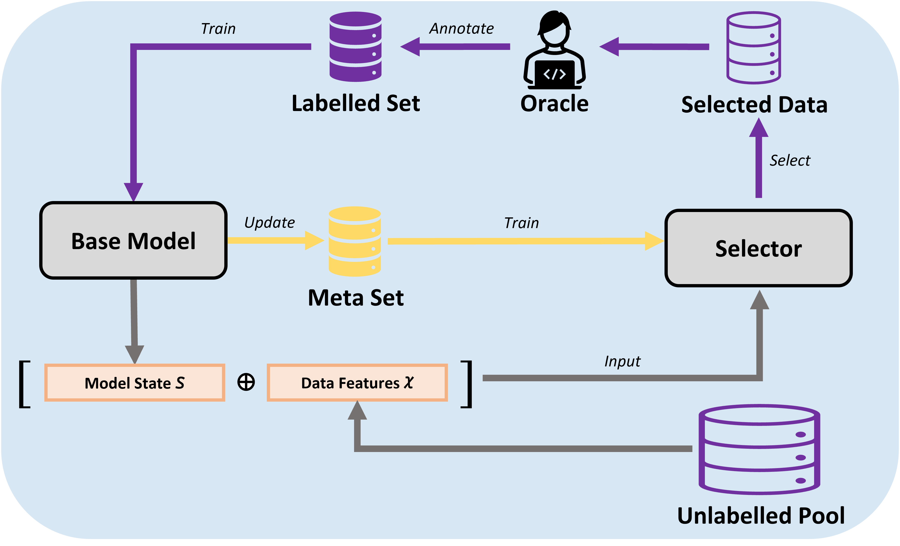

# Online Meta-learned Gradient Norms for Active Learning in Science and Technology

This repository contains code accompanying our project "Online Meta-learned Gradient Norms for Active Learning in Science and Technology". 

## OMAL
<p align="center">
  
</p>

Our method OMAL is described as the above pipeline and can be accessed in: \AL_methods\OMAL 


## Dependencies

The latest tested versions of the dependencies are listed:
- numpy                     1.23.5
- scipy                     1.11.4
- scikit-learn              1.3.0 
- pandas                    2.1.4
- torch                     2.0.0+cu118
- skorch                    0.13.0


## Code Structure

The code is structured as follows:
- Seeds: A set of shared seeds among different datasets for the reproducible results.
- Data_Processing: The processing code for each dataset.
- Datasets: References list for the data sets used in this research.
- Results: The folder to save the experimental results, and you need to create the subfolders by your way.
- AL_methods:
  - OMAL: The proposed method.
  - Random: The random sampling.

## Datasets

The datasets used in this study are all publicly available. The citations of the datasets are listed under the Datasets folder.


## License
Our source code is licensed under the Apache 2.0 license. 
We also include the MIT License of the modAL package since we used the source code of it (multi_argmax function in our method).

## Citations

```bibtex

@article{modAL2018,
    title={mod{AL}: {A} modular active learning framework for {P}ython},
    author={Tivadar Danka and Peter Horvath},
    url={https://github.com/modAL-python/modAL},
    note={available on arXiv at \url{https://arxiv.org/abs/1805.00979}}
}

```
